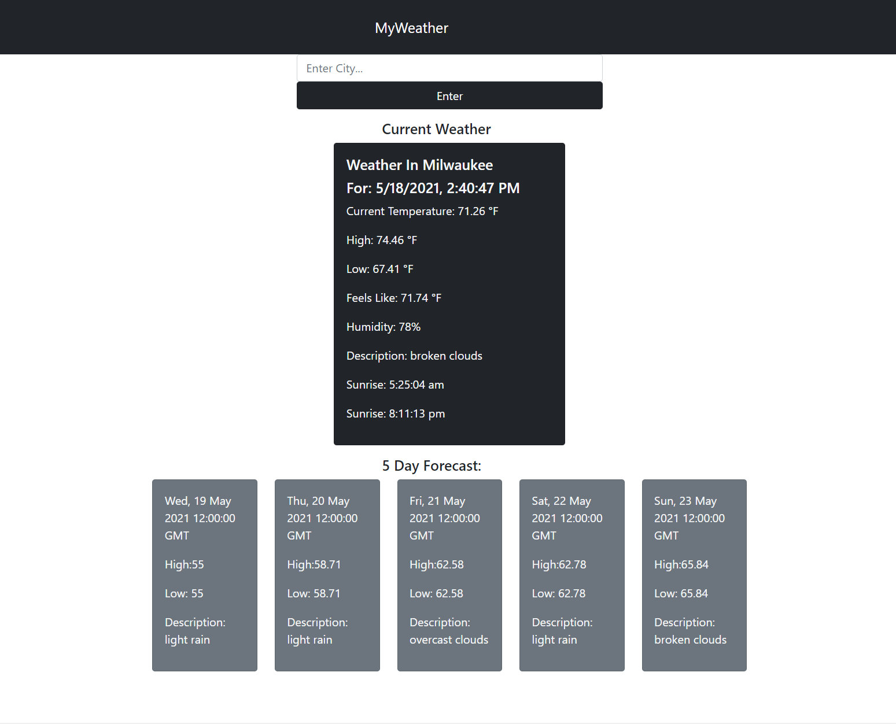

# weather-app


<!-- PROJECT LOGO -->
<br />
  <h3 align="center">Weather-App</h3>


<!-- TABLE OF CONTENTS -->
<details open="open">
  <summary>Table of Contents</summary>
  <ol>
    <li>
      <a href="#about-the-project">About The Project</a>
      <ul>
        <li><a href="#built-with">Built With</a></li>
      </ul>
    </li>
    <li>
      <a href="#getting-started">Getting Started</a>
      <ul>
        <li><a href="#prerequisites">Prerequisites</a></li>
        <li><a href="#installation">Installation</a></li>
      </ul>
    </li>
    <li><a href="#usage">Usage</a></li>
    <li><a href="#contact">Contact</a></li>
  </ol>
</details>


<!-- ABOUT THE PROJECT -->
## About The Project

<p align="center">
  <a href="https://github.com/othneildrew/Best-README-Template">
    
  </a>

I built this application as a technical challenge for an interview process. It was a fun project that took about 4-5 hours worth of work! What it accomplishes is finding the weather and weather forecast for a user based on location coordinates or search results. When you open the app, if you allow it access to your location data it will automatically find the current weather and 5 day weather forecast for your area based off of your longitude and latitude. You can also type into the text box any location you'd like to search for and the application will find whatever data is available for that city and display it. The API the application utilizes is over at https://openweathermap.org/ and is free to use!

### Built With

* [ReactJS](https://reactjs.org/)
* [React-Bootstrap](https://react-bootstrap.github.io/)


<!-- GETTING STARTED -->
## Getting Started

In order to use the project you must have Node.js installed.

### Prerequisites

This is an example of how to list things you need to use the software and how to install them.
* npm
  ```sh
  npm install npm@latest -g
  ```

### Installation

1. Get a free API Key at [https://openweathermap.org/api](https://openweathermap.org/api)
2. Clone the repo
   ```sh
   git clone https://github.com/marcus-baumgardner/weather-app
   ```
3. Install NPM packages
   ```sh
   npm install bootstrap react-bootstrap
   ```
4. Enter your API in a `.env` file in the main folder of the applicaiton (you must create this file)
   ```
    REACT_APP_API_URL = 'http://api.openweathermap.org/data/2.5'
    REACT_APP_API_KEY = [ YOUR API KEY GOES HERE ]
   ```

<!-- USAGE EXAMPLES -->
## Usage

Use this space to show useful examples of how a project can be used. Additional screenshots, code examples and demos work well in this space. You may also link to more resources.


<!-- CONTACT -->
## Contact

Marcus Baumgardner - [LinkedIn](https://www.linkedin.com/in/marcus-baumgardner-362956b8/) - m.baum429@gmail.com


Project Link: [https://github.com/marcus-baumgardner/weather-app](https://github.com/marcus-baumgardner/weather-app)

